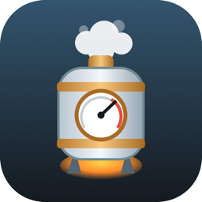

<div align="center">
  
  <h1>Boiler</h1>
  <p><strong>Cross-platform Steam for Godot C#, minus the boilerplate.</strong></p>
</div>

Ever wired Steam into a Godot C# game, gotten it running on Windows, and then
watched it fall over the moment you opened the project on a Mac or built for
Linux? That is the exact headache Boiler takes off your plate. Add the package,
call `SteamClient.Init`, and Steam works everywhere: Windows, macOS (Intel and
Apple Silicon), and Linux.

```csharp
using Steamworks;

SteamClient.Init(480);            // 480 is Spacewar, Valve's public test app
GD.Print($"Steam says hi to {SteamClient.Name}");
```

No DLL shuffling, no digging through `runtimes/` folders, no "works on my
machine." Boiler sets itself up when your game starts and gets out of the way.

## Why you need it

Steam in .NET is really two pieces glued together: a managed wrapper
([Facepunch.Steamworks](https://github.com/Facepunch/Facepunch.Steamworks)) and
Valve's native `steam_api` library. Getting them to load together inside Godot is
where the afternoon disappears, and it comes down to two things.

The first is that Godot ignores the way NuGet normally ships native libraries.
The `runtimes/<rid>/native` mechanism that works fine in a console app never
fires inside Godot's .NET host, so the native library just is not there when you
ask for it, and `SteamClient.Init` throws a "DLL not found" that tells you
nothing useful.

The second is that the two pieces have to agree on exact Steam interface
versions. Grab a wrapper from one release and a native binary from another and
the first time you touch Friends or networking you get an equally unhelpful
"entry point not found."

Boiler deals with both. It ships a managed and native pair pulled from the same
Facepunch release (so they cannot drift apart), copies the right native for your
platform next to your build, and installs a resolver at startup that actually
finds it, in the editor and in exported builds.

## What's in the box

| Platform | Managed wrapper | Native |
| --- | --- | --- |
| Windows x64 | `Facepunch.Steamworks.Win64` | `steam_api64.dll` |
| macOS (x64 and arm64) | `Facepunch.Steamworks.Posix` | `libsteam_api.dylib` (universal) |
| Linux x64 | `Facepunch.Steamworks.Posix` | `libsteam_api.so` |

You write against the normal Facepunch API. Boiler's whole job is making it load.

## Getting started

```
dotnet add package TheDevRatt.Steam.Boiler
```

Then use Facepunch the way you normally would. A module initializer registers the
native resolver before your first line of game code runs, so there is genuinely
nothing to wire up. If you would rather be explicit or kick it off early,
`SteamNative.Register()` is public and safe to call more than once.

Drop a `steam_appid.txt` next to your executable (or at your project root while
you are in the editor) so `SteamClient.Init` can run without launching through
the Steam client.

## Where it's at

Early, but working. It has been run end to end against a fresh Chickensoft
[GodotGame](https://github.com/chickensoft-games/GodotGame) template: Steam comes
online in the Godot editor on Apple Silicon with the snippet above and nothing
else. CI builds the package and smoke-tests that the native loads on Windows,
macOS, and Linux, plus a parity check that catches a mismatched version bump
before it ships.

Still on the to-do list:

* publish to NuGet.org
* a macOS codesigning and notarization guide for the bundled dylib in shipped apps
* zero-config support for consumers who bring their own Steam SDK build

## A couple of notes

Boiler bundles Valve's redistributable Steam binaries, the same way Facepunch,
Steamworks.NET, and GodotSteam do. You still need to be a Steamworks partner to
ship a real game on Steam.

The Facepunch wrapper is MIT licensed, and so is this.

## License

MIT. See [LICENSE](LICENSE).
